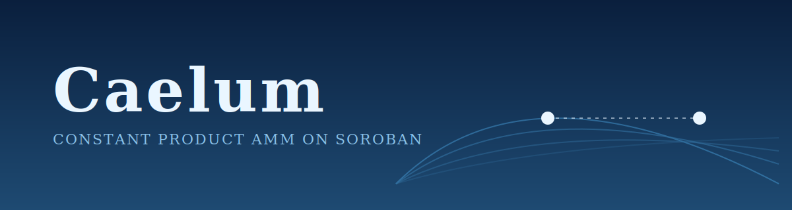

<p align="center">
  
</p>

<h1 align="center">Caelum</h1>

<p align="center">
  <em>Constant product automated market maker on Soroban. Permissionless pools, native Stellar assets, low fee swaps, on chain TWAP oracle.</em>
</p>

<p align="center">
  <a href="https://github.com/caelume-labs/Caelum/actions"></a>
  <a href="https://github.com/caelume-labs/Caelum/blob/main/LICENSE"></a>
  
  
</p>

<p align="center">
  <a href="#overview">Overview</a> ·
  <a href="#how-it-works">How it works</a> ·
  <a href="#architecture">Architecture</a> ·
  <a href="#smart-contracts">Smart contracts</a> ·
  <a href="#getting-started">Getting started</a> ·
  <a href="#using-the-sdk">Using the SDK</a> ·
  <a href="#roadmap">Roadmap</a> ·
  <a href="#contributing">Contributing</a>
</p>

---

## Overview

Caelum is an open source automated market maker built on Soroban. It implements the classic constant product model, `x * y = k`, the same design that has powered most of on chain liquidity since Uniswap v2.

Caelum exists because Stellar already has stablecoins, real payment flow and cheap settlement. What it has been missing is a battle tested open source liquidity layer that lets those assets swap against each other without going through a centralized exchange. Caelum fills that gap.

The protocol is permissionless: anyone can deploy a pool for any pair of Stellar assets through the factory, provide liquidity, swap, and pull liquidity out without asking anyone for permission. A TWAP consumer contract exposes time weighted average prices so other protocols can use Caelum pools as on chain oracles.

## How it works

1. The factory deploys a new pool contract for a pair of Stellar assets, with zero protocol approval needed.
2. Liquidity providers deposit both assets into the pool in proportion to the current reserves.
3. The pool mints LP share tokens proportional to the provider's contribution.
4. Traders swap between the two assets at the price implied by the current reserves, with a small swap fee that accrues to LPs.
5. The TWAP consumer reads pool reserves over time, producing manipulation resistant average prices that other protocols can rely on.
6. Liquidity providers can withdraw their share of the pool at any time by burning their LP tokens.

The math is the same as any constant product AMM. Reserves multiply to a constant `k`. A swap moves the reserves along the curve. Fees push `k` upward over time, which is how LPs accrue yield.

## Architecture

```
caelum/
  contracts/          Soroban smart contracts (Rust)
    amm/              Constant product pool contract
    factory/          Permissionless pool deployer
    token/            LP share token contract
    twap_consumer/    Time weighted average price oracle
    governance/       Protocol parameter governance (paused by default)
  examples/
    client/           TypeScript client examples (Node and browser)
    python/           Python client examples
  docs/               Math, storage layout, integration guides
  scripts/            Deployment automation
```

### Data flow

- **On chain**: reserves, LP share supply, swap volume, accumulated fees, TWAP samples.
- **Off chain (clients)**: pool discovery, route building, price calculations before submission.
- **Oracle integration**: external protocols read TWAP samples directly from the `twap_consumer` contract.

## Smart contracts

| contract | purpose |
|---|---|
| `amm` | Constant product pool. Holds reserves, prices swaps, mints and burns LP tokens, accrues fees. |
| `factory` | Permissionless deployer. Creates a new pool for any pair of Stellar assets, registers it for discovery. |
| `token` | LP share token. Tracks each provider's stake in a pool, transferable like any Soroban token. |
| `twap_consumer` | Reads pool reserves over time and produces time weighted average prices for oracle consumers. |
| `governance` | Reserved for future protocol parameter changes. Paused at deployment. |

All contracts are written in Rust with the Soroban SDK. The math, storage layout and rounding behaviour are documented under `docs/` alongside the code so reviewers can verify the implementation against the spec.

## Tech stack

- **Smart contracts**: Rust, Soroban SDK
- **Client examples**: TypeScript (Node.js, browser), Python
- **Tooling**: Cargo, Make, Docker Compose, rustfmt, clippy

## Getting started

### Prerequisites

- Rust 1.78 or newer and the Soroban CLI
- Node.js 20 or newer (for the TypeScript examples)
- Python 3.11 or newer (for the Python examples)
- Docker and Docker Compose

### Clone and bootstrap

```bash
git clone https://github.com/caelume-labs/Caelum.git
cd Caelum
```

### Build the contracts

```bash
make build
make test
```

### Run the local stack with Docker Compose

```bash
docker compose up -d
```

This brings up a Soroban local network so you can deploy the contracts and exercise the swap flow end to end against a local ledger.

## Using the SDK

### TypeScript

```ts
import { Caelum } from "@caelum/sdk";

const caelum = new Caelum({ rpc: "https://soroban-testnet.stellar.org" });

const pool = await caelum.factory.getPool({ tokenA: USDC, tokenB: XLM });
const quote = await pool.getQuote({ amountIn: 100n, tokenIn: USDC });

await pool.swap({ amountIn: 100n, tokenIn: USDC, minAmountOut: quote.amountOut * 99n / 100n });
```

Full examples for liquidity provision, swaps and oracle reads are in [examples/client/](examples/client/).

### Python

```python
from caelum import Caelum

caelum = Caelum(rpc="https://soroban-testnet.stellar.org")
pool = caelum.factory.get_pool(token_a=USDC, token_b=XLM)
quote = pool.get_quote(amount_in=100, token_in=USDC)
pool.swap(amount_in=100, token_in=USDC, min_amount_out=int(quote.amount_out * 0.99))
```

See [examples/python/](examples/python/) for the full set.

## Roadmap

- [x] AMM, factory, token, twap_consumer contracts implemented
- [x] Full math derivation and storage layout documented
- [x] TypeScript and Python client examples
- [x] Docker Compose local stack
- [ ] Futurenet end to end pass (in progress)
- [ ] External audit of the `amm` and `factory` contracts
- [ ] SDK packages published to npm and PyPI
- [ ] Public testnet pools with seed liquidity
- [ ] Mainnet launch with USDC pairs

## Contributing

Caelum welcomes contributions across the stack:

- **Contracts** (Rust): edge case tests, gas optimization, math review.
- **SDK and clients**: parity between TypeScript and Python, new language clients.
- **Docs**: integration guides for protocols that want Caelum as their liquidity layer.

1. Pick an unassigned issue tagged for your area.
2. Comment on the issue so a maintainer can assign you.
3. Fork the repo, create a branch (`feat/123-short-description`), open a pull request that references the issue.
4. A maintainer will review within 48 hours.

Contract changes touching reserves, math or storage layout require two reviewers.

## Security

If you find a vulnerability:

- Do **not** open a public issue.
- Read [SECURITY.md](SECURITY.md) for the disclosure process.

The `amm` and `factory` contracts are slated for external audit before mainnet. Audit reports will be linked here when available.

## License

[MIT](LICENSE)
